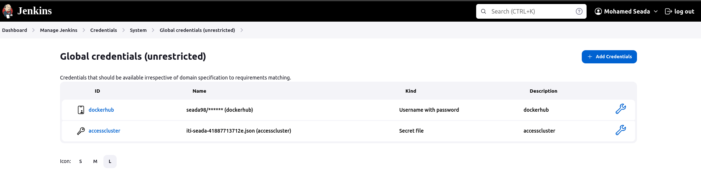
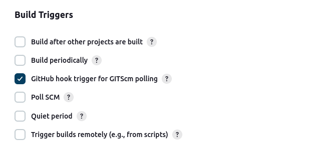
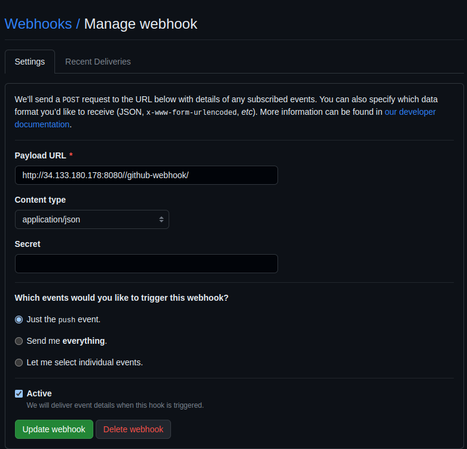
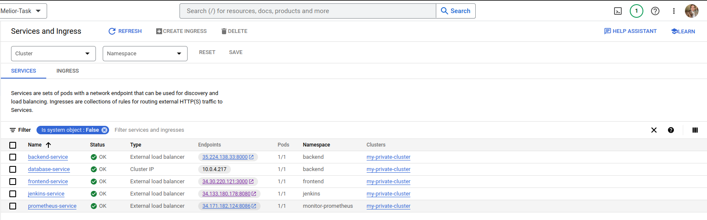
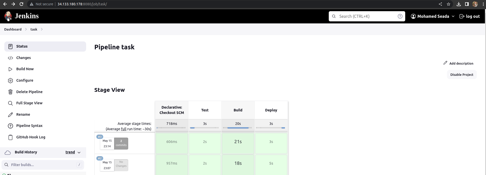
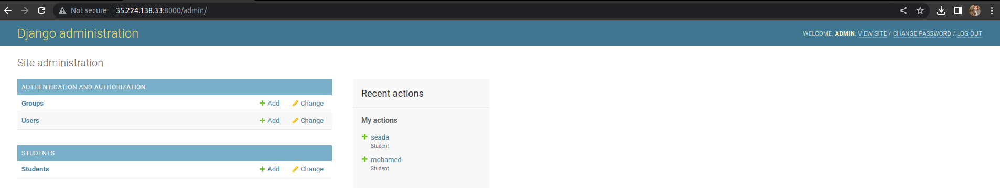
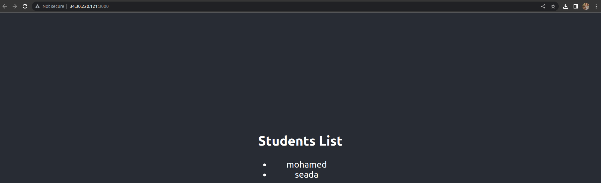

# Jenkins CI/CD Pipeline To Build and Deploy a Full Web App

### Jenkins application running as a pod on a GKE cluster (Google Cloud Platform resource) which is used to build and deploy a React , Django and Postgres.

### This project is based on an infrastructure repository: 

https://github.com/seada98/Melior-Task-Infrastructure

## Illustrations & Setup

### Jenkins Credentials Configurations:
- Create a credential for your Dockerhub account.
- Secret file credentials that contains the VM service account key pair file in order to have access to the cluster.

### Dockerfile

Created a Dockerfile to Dockerize My Web App

### Jenkinsfile

Created a Jenkinsfile with Test , Build and Deploy Stages 

#### Test stage:
 
- Setup the environment 
- Run python script for tetsing the code 

#### Build stage:

- Building the image with a version number equals to the Jenkins build number. 
- Passing the Dockerhub credentials in order to login.
- Pushing the new image to Dockerhub.

BUILD_NUMBER is an environment variable.

- Passing the service account credentials to connect to the cluster.
- Replacing the "tag" in the deployment file with the new BUILD_NUMBER (version).
- Deploying the app with kubectl.

#### Build stage:
- Passing the service account credentials to connect to the cluster.
- Replacing the "tag" in the deployment file with the new BUILD_NUMBER (version).
- Deploying the app with kubectl.

### Create New Pipeline With Pipeline script from SCM

- Choose type for SCM (Git) , Put Your Repository Link
- If The Repo Private We Need Add Credential Github Username And Password
- Check Branch Name In Your Repo

#### GitHub Webhook

Changing the pipeline configurations by activating the "GitHub hook trigger for GITScm polling".

From GitHub -->
- Add a webhook.
- Add the jenkins URL/github-webhook/ to the Payload URL.

### The Web App is successfully deployed! 

### Add something in database with django dashboard 

